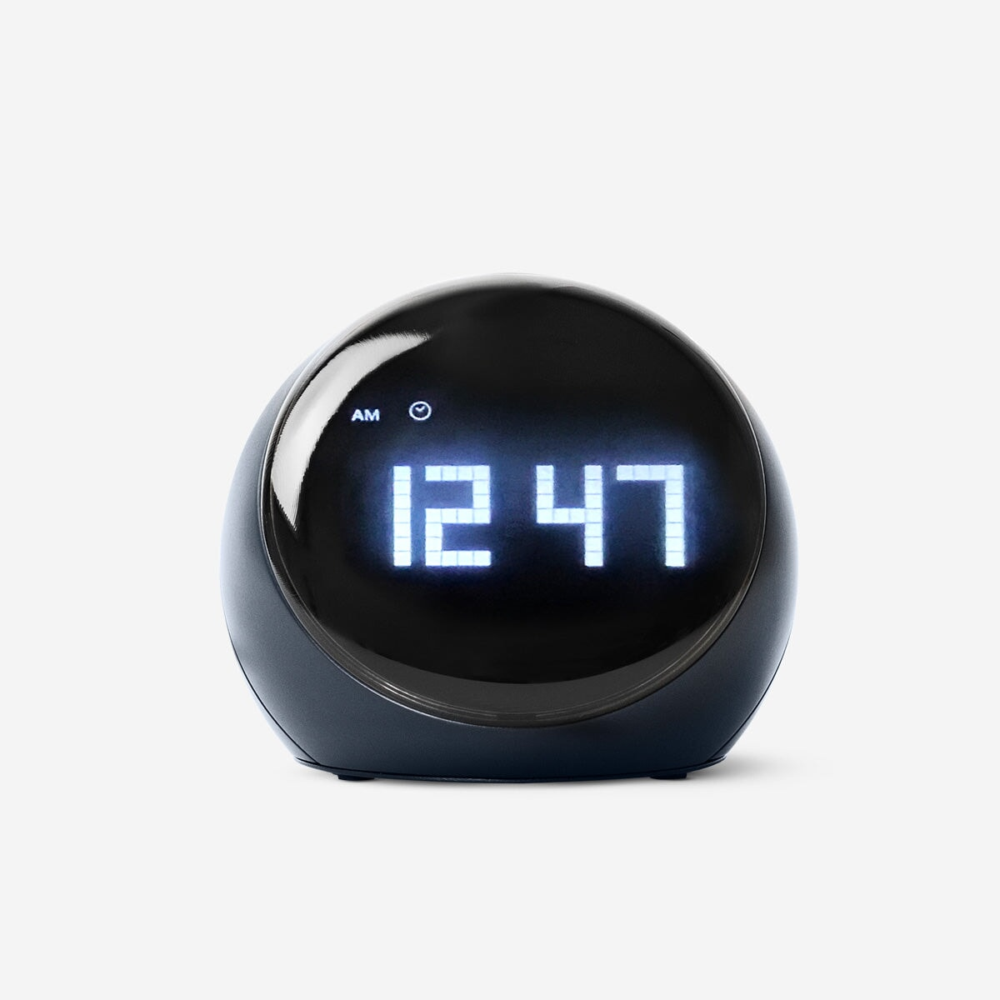
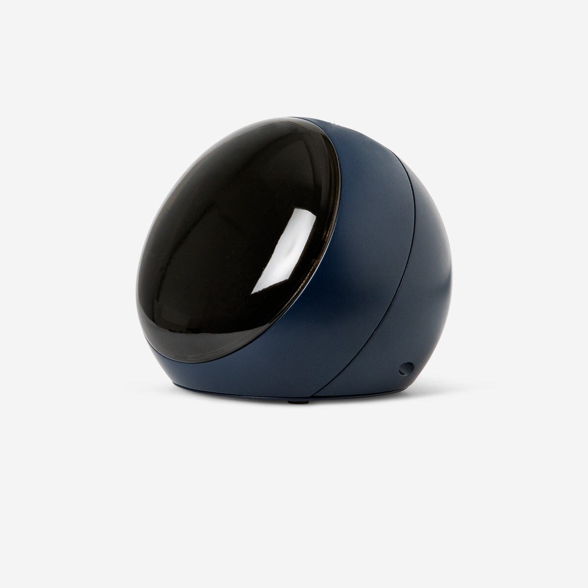
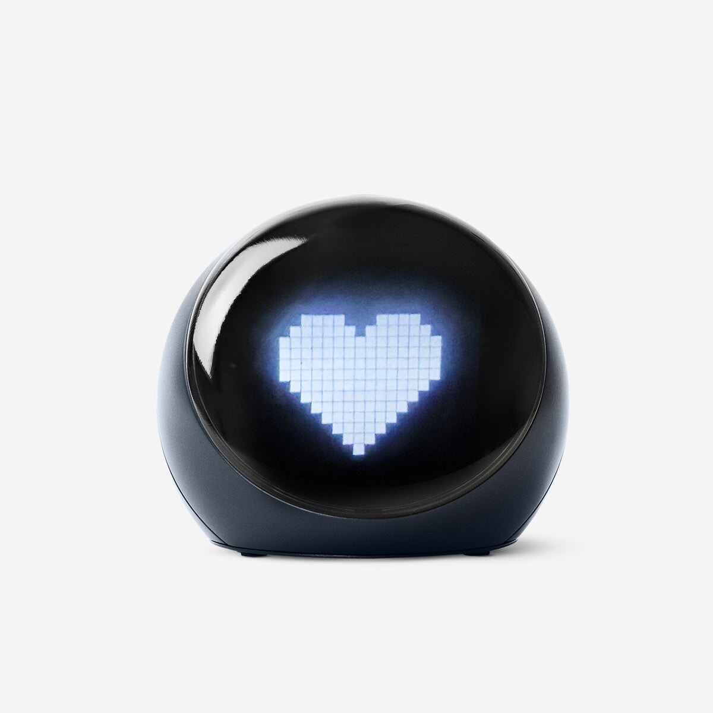
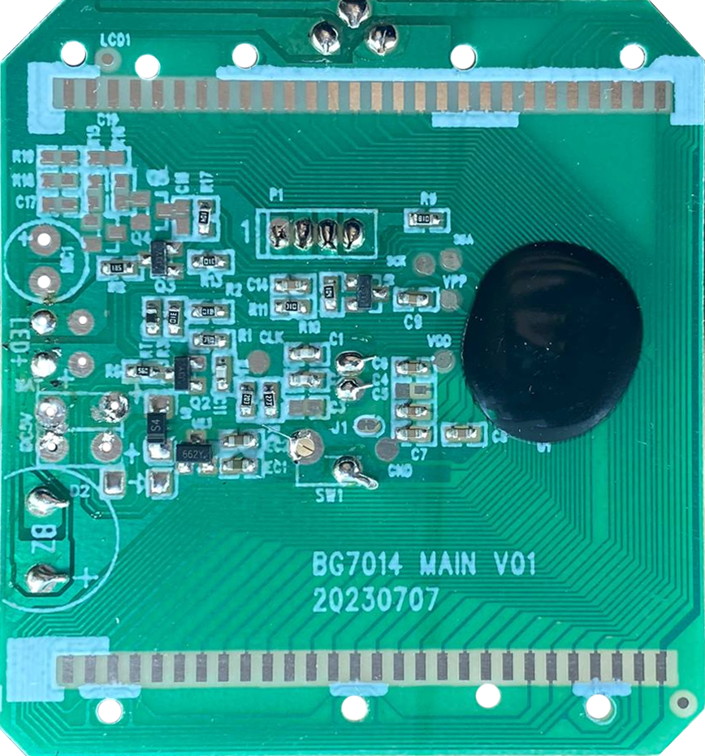
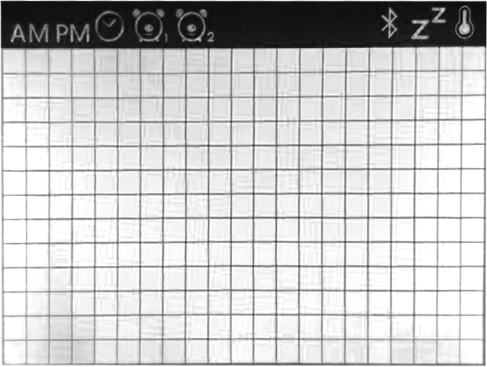
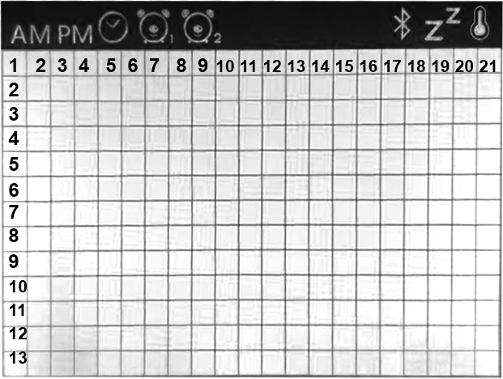
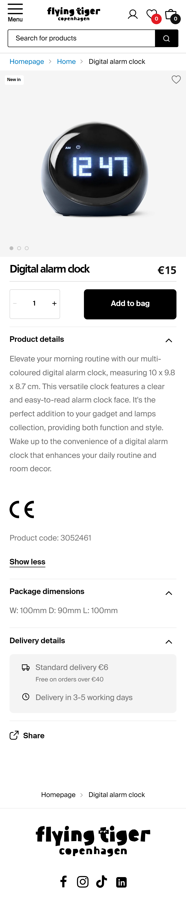
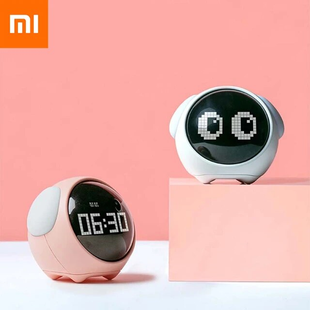
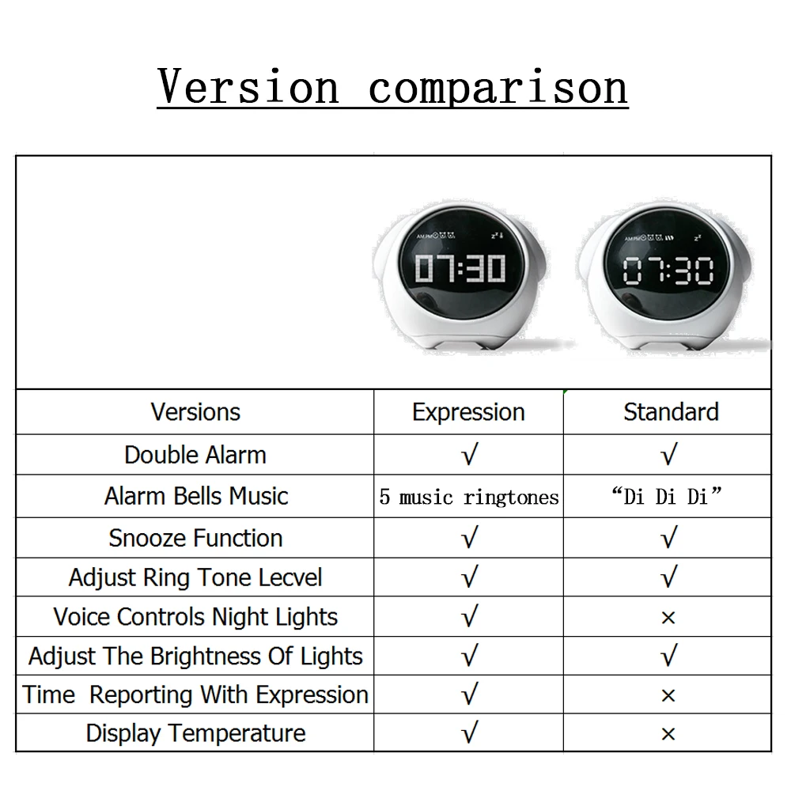

# ⏰ MOD FLYING TIGER ALARM CLOCK [ARDUINO/ESP] #

  

### Specifications ###
* Alarm clock functions
* Temperature Sensor
* Working with 5v or 3xAAA Battery
* Screen resolution 21x13 LiquidCrystal

 

 

----------------------------------------------------------

### Product details ###

 
 
Elevate your morning routine with our multi-coloured digital alarm clock, measuring 10 x 9.8 x 8.7 cm. This versatile clock features a clear and easy-to-read alarm clock face. It's the perfect addition to your gadget and lamps collection, providing both function and style. Wake up to the convenience of a digital alarm clock that enhances your daily routine and room decor.

    

----------------------------------------------------------

### Reference ###
- [Xiaomi Youpin Cute Expression Pixel Alarm Clock](https://www.google.com/search?sca_esv=ded9c88ad4b82f1e&sxsrf=ACQVn0-NeR-PIPLF_d_PDwCqXzfSN-wNwg:1708764447108&q=Xiaomi+Youpin+Cute+Expression+Pixel+Alarm+Clock&uds=AMwkrPvaS6cFqE5mWOiRcl_VViffT-R44h0wMMYN8EILh05o17Q9G8GiqMDlHkLLpR2X7gx7gpxLMRhwZOP6Ks4iVnHawZbauunL4yCT0-zxK-dvRGJGEzxs1A8d3h9bZQJGSbYV2GSBHMGxGMFt_5ZoZUy6JgncB36ZLhM_JQTK7jXXAL3TUxs&udm=2&sa=X&ved=2ahUKEwj2mv_Oy8OEAxUv_bsIHWLMDtoQtKgLegQIDBAB&biw=1920&bih=911&dpr=1)

 